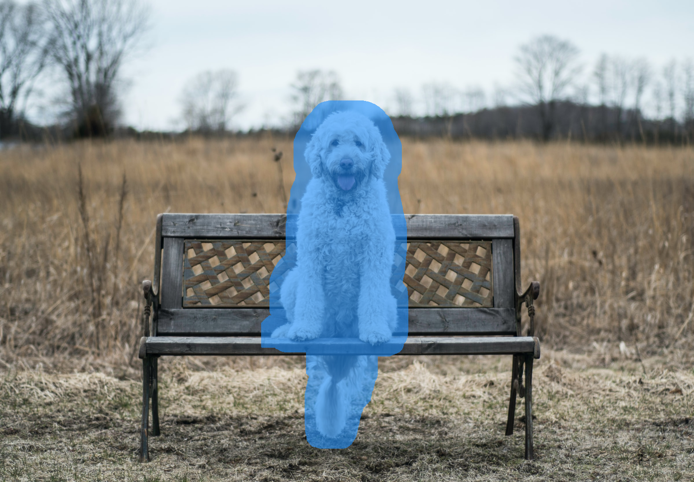

# Inpaint-Anything-Description
you can replace some objects of input image  according to the description of objects
# Install
create env Requires python>=3.8

```
conda create -n inpaint python=3.8
conda activate inpaint
```
clone repository from GitHub.
```
git clone https://github.com/Atlas-wuu/Inpaint-Anything-Description.git

```
install torch/sam/diffusers/grounding dino
```
cd Inpaint-Anything-Description
pip install torch torchvision torchaudio
pip install -e segment_anything
pip install diffusers transformers accelerate scipy safetensors

cd GroundingDINO
pip install -q -e .
```

# Usage
Download the model checkpoints provided in `grounding dino`([Swin-T](https://huggingface.co/ShilongLiu/GroundingDINO/resolve/main/groundingdino_swint_ogc.pth)、[Swin-B](https://huggingface.co/ShilongLiu/GroundingDINO/resolve/main/groundingdino_swinb_cogcoor.pth))/ `segment_anything`([ViT-H](https://dl.fbaipublicfiles.com/segment_anything/sam_vit_h_4b8939.pth)、
[ViT-L](https://dl.fbaipublicfiles.com/segment_anything/sam_vit_l_0b3195.pth)、[ViT-B](https://dl.fbaipublicfiles.com/segment_anything/sam_vit_b_01ec64.pth)) 
/ `lama`(e.g. [sam_vit_h_4b8939.pth](https://dl.fbaipublicfiles.com/segment_anything/sam_vit_h_4b8939.pth) 
and [big-lama](https://disk.yandex.ru/d/ouP6l8VJ0HpMZg)), and put them into `./pretrained_models`.
```
cd Inpaint-Anything-Description

python fill_anything_str.py \
    --input_img ./example/fill-anything/sample1.png \
    --src_prompt "white dog"  \
    --dst_prompt "bear" \
    --dilate_kernel_size 50 \
    --output_dir ./results \
    --grounddino_model_type "swin_t" \
    --grounddino_ckpt ./pretrained_models/groundingdino_swint_ogc.pth \
    --sam_model_type "vit_h" \
    --sam_ckpt ./pretrained_models/sam_vit_h_4b8939.pth
```
# Demo
source object description: "white dog"

target object description: "bear"
<table>
  <tr>
    <td></td>
    <td></td>
    <td></td>
  </tr>
</table>


# Acknowledgments
- [Inpaint-Anything](https://github.com/geekyutao/Inpaint-Anything)
- [GroundingDINO](https://github.com/IDEA-Research/GroundingDINO)
- [Segment Anything](https://github.com/VainF/Awesome-Anything)
- [LaMa](https://github.com/advimman/lama)
- [Stable Diffusion](https://github.com/CompVis/stable-diffusion)